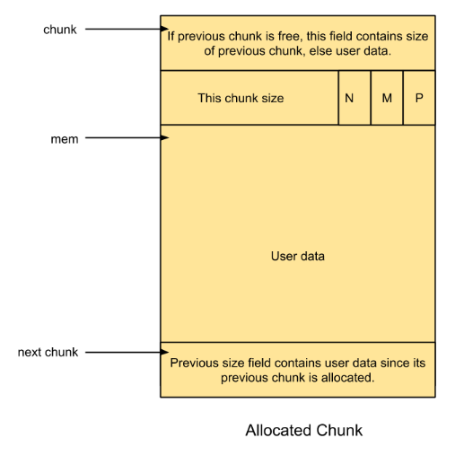
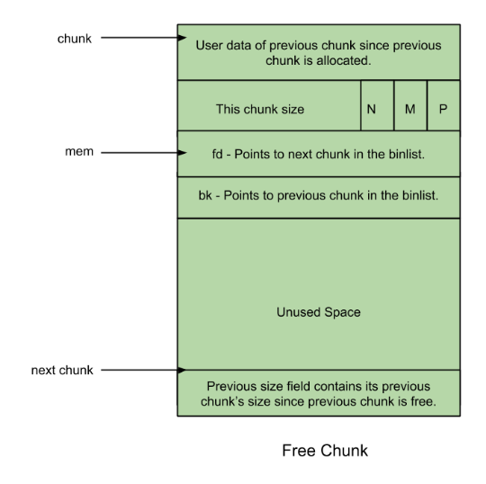

## Heap 
***

#### malloc의 종류
- dlmalloc : 일반적인 목적의 메모리 할당자
- ptmalloc2 : GNU library (glibc)에서 사용하는 메모리 할당자
- jemalloc : FreeBSD와 Firefox에서 사용하는 메모리 할당자
- tcmalloc : Google(Chrome)에서 사용하는 메모리 할당자
- libumem : Solaris에서 사용하는 메모리 할당자

__이 문서에서는 glibc에서 사용하는 ptmalloc2에 대해서만 다룬다.__ 
<br/>
#### malloc은 내부적으로 brk 또는 mmap syscall을 호출
- brk (sbrk) 함수는 program break의 위치를 변경한다. (program break는 프로세스의 data segment의 끝을 가리킴. 즉, program break를 값을 증가시키면 프로세스에 할당되는 메모리의 크기를 증가시키는 효과)
- malloc 함수가 내부적으로 brk를 통해서 메모리를 할당하면 해당 영역은 data segment와 붙어있다. 
- mmap을 통해 메모리를 할당하면 data segment와 붙어있지 않다.
<br/>

#### ptmalloc2 : 스레딩 지원
- 각 스레드는 분리된 힙 segment와 각 힙 segment를 관리하는 freelist data structure를 (동적 메모리 할당에서 할당되지 않은 영역들을 연결 리스트로 연결하여 관리하는 것) 가지고 있다. (per thread arena) 따라서 두 개의 스레드가 동시에 malloc을 호출하면 즉시 메모리가 할당된다. (dlmalloc의 경우 스레드 간에 freelist data structure를 공유해서 한 번에 하나의 메모리 할당만 가능)
- glibc malloc에서 freelist data structure는 bin이라고 불린다. (스레드마다 bin을 따로 관리)
<br/>

#### Arena
- main 및 각 thread에 대한 heap 영역
- 어플리케이션이 가질 수 있는 arena 개수는 현재 시스템의 core 개수에 따라 다르다.

#### ptmalloc2에 있는 data structure
- heap_info (heap header)
```c
typedef struct _heap_info 
{
  mstate ar_ptr;    /* 현재 heap을 담당하고 있는 Arena */
  struct _heap_info *prev;  /* 이전 heap 영역 */
  size_t size;      /* 현재 size(bytes) */
  size_t mprotect_size; /* mprotected(PROT_READ|PROT_WRITE) size(bytes) */
  char pad[(-6*SIZE_SZ)&MALLOC_ALIGN_MASK]; /* 메모리 정렬 */
  /* sizeof(heap_info) + 2*SIZE_SZ는 MALLOC_ALIGN_MASK의 배수 */
} heap_info;
```

하나의 arena는 처음에 하나의 heap을 갖는다. 하지만 이 heap segment를 다 사용하면 arena는 mmap을 통해서 새로운 heap을 할당받는다. (이전의 heap과 연속적이지 않은 영역에)
- malloc_state (arena header)
```c
struct malloc_state
{
  /* Serialize access.  */
  mutex_t mutex;
 
  /* Flags (formerly in max_fast).  */
  int flags;
 
  /* Fastbins */
  mfastbinptr fastbinsY[NFASTBINS];
 
  /* topchunk의 base address */
  mchunkptr top;
 
  /* 가장 최근의 작은 요청으로부터 분리된 나머지 */
  mchunkptr last_remainder;
 
  /* 위에서 설명한대로 pack된 일반적인 bins */
  mchunkptr bins[NBINS * 2 - 2];
 
  /* Bitmap of bins */
  unsigned int binmap[BINMAPSIZE];
 
  /* 연결 리스트 */
  struct malloc_state *next;
 
  /* 해제된 아레나를 위한 연결 리스트 */
  struct malloc_state *next_free;
 
  /* 현재 Arena의 시스템으로부터 메모리 할당  */
  INTERNAL_SIZE_T system_mem;
  INTERNAL_SIZE_T max_system_mem;
};
```
각 arena는 하나의 header를 갖는다. header는 bins, top chunk, last remainder chunk에 관한 정보를 포함한다.
- malloc_chunk (chunk header)
```c
struct malloc_chunk 
{
  INTERNAL_SIZE_T      prev_size;  /* Size of previous chunk (if free).  */
  INTERNAL_SIZE_T      size;       /* Size in bytes, including overhead. */
 
  struct malloc_chunk* fd;         /* double links -- used only if free. */
  struct malloc_chunk* bk;
 
  /* large chunk에서만 사용하고 해당 bin list의 크기 순서를 나타냄  */
  struct malloc_chunk* fd_nextsize; /* double links -- used only if free. */
  struct malloc_chunk* bk_nextsize;
};
```

하나의 heap은 여러 개의 chunk로 나누어진다. 각 chunk는 각자의 header를 갖는다.  

__NOTE:__
- main arena는 하나의 heap만 갖는다. 따라서 heap_info를 갖지 않는다. (main arena가 space를 다 사용하면 sbrk를 통해서 heap segment를 확장한다.)
- thread arena와 다르게 main thread arena header는 sbrk 힙 영역의 일부가 아니다. main arena header는 전역 변수이며 libc.so의 data segment에 속한다. 

#### Chunk 
32비트에서는 8의 배수, 64비트에서는 16의 배수 <br/>
chunk의 최소 크기는 4*sizeof(void*) 이다. (size, fwd, bck, prev_size를 모두 담으려면 저 사이즈가 필요) <br/>
> heap segment에 존재하는 chunk의 종류
 - allocated chunk
 - free chunk
 - top chunk
 - last remainder chunk



> allocated chunk
- prev_size
  : 이전 chunk가 free되면 해당 field는 이전 chunk의 사이즈를 포함한다. 만약 이전 chunk가 할당된 상태이면 이 field는 이전 chunk의 user data 영역으로 사용됨
- size
  : 해당 field는 할당된 chunk의 size를 포함한다. 마지막 3비트는 flag 정보를 나타낸다. (PREV_INUSE, IS_MAPPED, NON_MAIN_ARENA)

__NOTE:__
- fd, bk와 같은 malloc_chunk는 allocated chunk에서는 사용되지 않음. (대신 해당 영역은 user data 영역으로 사용됨)
- 사용자가 요청한 사이즈는 usable size로 변경되어 할당된다. (헤더를 위한 공간 or alignment를 위해서)



> free chunk
- prev_size
  : free한 두 개의 chunk가 인접하고 있으면 하나의 free chunk로 병합된다. 따라서 
- size
  : free chunk의 크기를 포함함
- fd
  : 같은 bin에 있는 다음 chunk를 가리킴 (물리적으로 다음 chunk를 가리키는 것이 아니라)
- bk
  : 같은 bin에 있는 이전 chunk를 가리킴
<br/>
#### Bins <br/>
bin은 freelist data structure이다. (free chunk들을 관리하기 위한 연결 리스트) <br/>
chunk의 크기에 따라서 여러 개의 bin으로 나누어진다. (각 bin들은 포인터 배열)
- Fast bin
- Unsorted bin
- Small bin
- Large bin

bin을 포함하는 data structure
- fastbinsY (fast bin들을 저장하고 있는 배열)
- bins (unsorted bin, small bin, large bin을 저장하고 있는 배열 총 126개의 bin이 존재한다.)
  - Bin 1 : Unsorted bin
  - Bin 2 - Bin 63 : Small bin
  - Bin 64 - Bin 126 : Large bin

__Fast bin__ <br/>
 16 - 80 바이트 크기의 chunk는 fast chunk라 불린다. (fast chunk를 저장하고 있는 bin을 fast bin이라 함) <br/>
  모든 bin 중에서 fast bin이 메모리 할당 및 할당 해제 속도가 빠름 
 
- bin의 개수 (10개)
  : 각 fast bin은 free chunk의 single linked list를 (binlist) 포함한다. fast bin은 list의 중간에 있는 chunk부터 제거되지 않기 때문에 single linked list이다. (LIFO 구조이다.)  
- chunk size (8바이트 단위)
  : 첫 번째 fast bin (index 0)은 16 바이트 크기의 chunk를 포함, 두 번째는 24 바이트 크기 chunk 포힘
  (같은 fast bin에 있는 chunk들은 모두 같은 크기)
- fast bin에 있는 free chunk들은 인접해 있어도 병합하지 않는다. (prev_inuse 비트가 항상 set 되어 있다)
- fast bin index가 비어있으면 사용자가 fast chunk를 요청했을 때 small bin이 해당 요청을 처리한다.
- fast bin에 있는 chunk가 malloc될 때에 해당 free chunk header의 size 값과 실제 할당을 요청한 크기가 같은지 체크한다. (fastbin_dup 같은 공격을 할 때 fake header를 구성해줘야 함)
- fast bin은 free 시점에 fast bin이 가리키는 chunk와 (가장 마지막에 free한 chunk) 현재 free하는 chunk가 같은 것인지 체크한다. 

__Unsorted bin__ <br/>
small, large chunk가 free되면 처음에는 unsorted bin에 추가된다. 
- bin의 개수 (1개)
  : unsorted bin은 circular double linked list를 포함한다. (FIFO 구조)
- chunk size
  : size 제한이 없다. (모든 크기의 chunk가 포함됨)
- 모든 chunk는 재할당을 위한 1번의 기회가 주어지고 재할당에 실패한 경우 크기에 따라 small bin 또는 large bin에 재배치됨 (재할당에 성공하면 unsorted bin에 있는 chunk들은 계속 unsorted bin에 존재)
- unsorted chunk는 NON-MAIN-ARENA 플래그를 절대 세팅하지 않는다.

__Small bin__ <br/>
512 바이트 보다 작은 크기의 chunk를 small chunk라 한다.
- bin의 개수 (62개)
  : 각 small bin은 circular double linked list를 포함
search를 앞에서 부터 한다. (FIFO 구조)
- chunk size (8바이트 단위)
  : 첫 small bin (Bin 2)은 16바이트 크기의 chunk를 포함, 두 번째 small bin은 24바이트 크기의 chunk 초함
- 인접한 두 free small chunk는 병합한다. 병합 이후에 unsorted bin 앞에 추가된다. (unsorted chunk가 인접한 경우에는 병합하지 않는다.)
- 처음에는 small bin들이 모두 NULL이기 때문에 사용자가 small chunk를 요청하면 unsorted bin이 해당 요청을 처리한다. (첫 malloc을 통해서 small bin, large bin data structrue가 비어있음을 나타내도록 초기화된다.)


__Large bin__ <br/>
512 바이트 보다 큰 chunk를 large chunk라 한다. 
- bin의 개수 (63개)
  : 각 large bin은 circular double linked list를 포함
- 32개의 bin은 64바이트 크기 단위로 나뉘어져 있으며 16개의 bin은 512 바이트 크기 단위, 8개의 bin은 4096바이트 크기 단위, 4개의 bin은 32768 바이트 크기 단위, 2개의 bin은 262144 바이트 크기 단위, 1개의 bin은 나머지 크기의 chunk를 포함. (첫 번째 large bin은 512 - 568 바이트 크기의 chunk를 포함)
- large bin내의 chunk들은 크기를 기준으로 내림 차순 정렬되어 있다. (가장 앞쪽이 가장 큰 chunk)
- 인접한 free chunk들은 병합된다.
- 처음에는 large bin들이 모두 NULL이기 때문에 large bin을 요청하면 그 다음으로 가장 큰 bin이 해당 요청을 처리한다. (첫 malloc을 통해서 small bin, large bin data structrue가 비어있음을 나타내도록 초기화된다.)
- large bin은 뒤에서 부터 앞으로 search를 진행한다. (FIFO 구조) 그리고 요청한 크기와 동일하거나 가장 비슷한 크기의 free chunk를 찾는다. 그 이후 해당 chunk는 두 개의 chunk로 나뉜다.
  - User chunk (사용자에게 반환되는 chunk)
  - Remainder chunk (unsorted bin에 추가됨)
- 만약 요청된 chunk 사이즈가 binlist에서 가장 큰 chunk size 보다 크면 해당 binlist보다 더 큰 binlist에서 적절한 chunk를 찾아서 사용한다. 만약 없으면 top chunk에서 해당 요청을 처리한다.


__Top chunk__ 
- arena의 가장 윗 부분에 존재하는 chunk 
- top chunk는 어떠한 bin에도 속하지 않는다. 
- 만약 top chunk보다 더 큰 chunk를 요청하면 main arena에서는 sbrk를 통해서 top chunk의 크기를 늘리고 thread arena에서는 mmap을 통해서 top chunk의 크기를 늘린다. (sysmalloc 함수를 통해 mmap, sbrk syscall 호출, sysmalloc 함수는 메모리를 한 번 해제한 후 재할당하는 식으로 확장)
- top chunk는 이전 chunk가 free되면 병합 (fast bin은 제외)


__Last Remainder Chunk__ <br/>
가장 최근 사용자 요청에 의해 발생한 분할에 의해서 발생한 remainder chunk <br/>
last remainder chunk는 지역 참조성을 향상시킨다. 즉, 연속적으로 small chunk를 요청하면 서로 인접한 chunk가 할당된다. <br/>
예를 들어서 사용자가 small chunk를 요청했을 때 small bin과 unsorted bin에 해당 요청을 처리할 chunk가 존재하지 않으면 binmap은 그 다음으로 큰 bin을 scan한다. 그리고 해당 bin에 있는 chunk는 user chunk와 remainder chunk로 나누어진다. (이 remainder chunk가 last remainder chunk가 된다.) 그 다음, 사용자가 small chunk를 요청하고 unsorted bin에 last remainder chunk만 존재하게 되면 해당 last remainder chunk는 또 다시 두 개의 chunk로 나누어진다. 따라서 연속적인 메모리 할당이 서로 인접하게 된다.  

참조 : 
<https://sploitfun.wordpress.com/2015/02/10/understanding-glibc-malloc/> <br/>
<https://tribal1012.tistory.com/141?category=658553>

