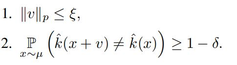

## 1. Introduction
위 논문은 DNN classifier를 속일 수 있는 단일 universal perturbation이 존재함을 보여준다. 기존의 adversarial perturbation은 data point에 의존적이어서 각 data point에만 적용할 수 있는 반면에 universal perturbation은 Fig. 1에서 볼 수 있듯 하나의 perturbation을 모든 natural image에 적용할 수 있다. main contribution은 다음과 같다.
- 최신 DNN classifier를 속일 수 있는 universal image-agnostic perturbation이 존재함을 보여줌
- universal perturbation을 찾는 algorithm 제시
- universal perturbation의 일반화 특성을 보여줌 (training set에서 찾은 universal perturbation이 높은 확률로 새로운 이미지에도 적용됨을 보여줌)
- 하나의 DNN classifier에서 찾은 universal perturbation이 다른 DNN classifier에도 적용됨을 보여줌
- 서로 다른 decision boundary 간의 기하학적인 상관관계를 분석함으로써 DNN classifier가 universal perturbation에 취약한 이유를 분석

###### Figure 1 : : When added to a natural image, a universal perturbation image causes the image to be misclassified by the deep neural network with high probability. Left images: Original natural images. The labels are shown on top of each arrow. Central image: Universal perturbation. Right images: Perturbed images. The estimated labels of the perturbed images are shown on top of each arrow.

## 2. Universal perturbations
universal perturbation은 대부분의 x ∈  R^d에 대해서 다음 식을 만족하는 벡터 v를 찾는 것이다.    

 
( µ : R^d에 존재하는 이미지들의 분포 의미 , k : 이미지의 label을 출력하는 분류 함수)
  
벡터 v는 다음의 조건을 만족한다.  

 
(p ∈ \[1, ∞))   
ξ를 통해서 perturbation의 크기를 조절할 수 있고 δ를 통해서 fooling rate를 조절할 수 있다.   

###### Figure 2: Schematic representation of the proposed algorithm used to compute universal perturbations. In this illustration, data points x1, x2 and x3 are super-imposed, and the classification regions Ri (i.e., regions of constant estimated label) are shown in different colors. Our algorithm proceeds by aggregating sequentially the minimal perturbations sending the current perturbed points xi + v outside of the corresponding classification region Ri.
 **알고리즘**  
X = {x1,...,xm} 은 µ에서 추출한 이미지의 집합이라 하자. 알고리즘은 위의 노름 조건과 fooling rate를 만족하는 perturbation v를 찾고자 한다. 알고리즘은 Fig. 2와 같이 현재 perturbed point인 xi + v를 decision boundary로 보내는 가장 작은 ∆vi를 구한다. 그리고 ∆vi를 v에 더한다. (현재의 perturbation인 v가 xi의 classification region을 변경하지 못하면 ∆vi를 계산한다.) 위의 행위를 X의 data point에 대해서 반복한다. ∆vi는 아래의 최적화 문제를 통해 구할 수 있다.   

  
알고리즘의 pseudo 코드는 다음과 같다.

위 코드에서 ∆vi를 구하는 최적화 문제는 k가 DNN 같은 standard classifier인 경우 convex 하지 않지만 [19,11,7] 논문에 있는 방식을 통해서 효율적으로 근사가 가능하다. (여기에서는 deepfool 방식을 사용했다.) 

## 3. Universal perturbations for deep nets
위의 알고리즘을 통해 찾아낸 universal perturbation을 최신 DNN classifier에 적용해보았다. ILSVRC 2012 대회의 Training data set X를 통해 universal perturbation을 찾고 이를 validation set에 적용했다. (p = 2, ξ = 2000인 경우와 p = ∞, ξ = 10인 경우에 대해서 실험을 진행했다. 해당 수치는 이미지의 norm보다 매우 작은 값이기 때문에 natural image에 더해졌을 때 사람이 이를 인식하기 어렵다.) Table 1에서 볼 수 있듯이 validation set에 대해서 높은 fooling rate를 얻었다. 

###### Table 1: Fooling ratios on the set X, and the validation set.
Fig. 6에서는 X의 크기에 따른 fooling rate를 나타내었다. ImageNet은 총 1000개의 class를 포함하는데 X가 500개의 이미지일 때에도 30%가 넘는 fooling rate를 얻는다. 이를 통해서 universal perturbation은 처음보는 이미지 (class)에도 적용됨을 확인할 수 있다. 

###### Figure 6: Fooling ratio on the validation set versus the size of X. Note that even when the universal perturbation is computed on a very small set X (compared to training and validation sets), the fooling ratio on validation set is large.
**Cross-model universality**  
universal perturbation은 처음보는 이미지에 대해서 universality인 성질을 갖는 것 뿐만 아니라 서로 다른 model에 대해서도 어느 정도 universality를 갖는다. 즉, 특정 모델에서 찾은 (계산된) perturbation이 다른 모델에도 적용된다. 이는 Table 2에서 확인할 수 있다.   

###### Table 2: Generalizability of the universal perturbations across different networks. The percentages indicate the fooling rates. The rows indicate the architecture for which the universal perturbations is computed, and the columns indicate the architecture for which the fooling rate is reported.
**Visualization of the effect of universal perturbation**  
universal perturbation의 효과에 대해 살펴보기 위해서 validation set의 label 분포를 그래프로 나타내었다. 각 노드는 perturbation이 적용되기 전의 label이고, 엣지 (i -> j)는 i class에 있는 이미지가 대부분 j class로 바꼈음을 나타낸다. Fig. 7의 그래프는 GoogleLeNet을 이용해서 구성했다. 대부분의 노드는 하나의 엣지를 가졌고, 지배적인 label이 존재했다. 해당 논문에서는 지배적인 label이 더 큰 image space를 갖는다고 가설을 세웠다. (image space가 input space를 말하는건듯??)  

**Fine-tuning with universal perturbations**  
1/2 확률로 universal perturbation가 적용된 training data를 이용해서 VGG-F 모델을 5 epoch 동안 훈련했다. 그 이후에 이 모델에 대해서 새로운 universal perturbation을 찾고 validation data에 이를 적용한 결과 fooling rate는 76.2%가 나왔다. (fine tuning을 하지 않았을 때는 93.7%였다.) update된 모델에 대해서 동일한 훈련을 반복한 결과 fooling rate는 80%로 증가했다. 따라서 fine tuning으로 어느 정도의 robustness 향상을 얻을 수는 있지만, universal perturbation을 완전히 방어할 수는 없다. 
## 4. Explaining the vulnerability to universal perturbations
이 섹션에서는 DNN classifier가 universal perturbation에 취약한 이유에 대해서 분석한다. 우선 universal perturbation의 독특한 특성을 파악하기 위해서 validation data에 대한 fooling rate를 다른 perturbation들과 비교를 해봤다. 비교 대상에는 random perturbation, DF와 FGSM을 사용한 adversarial perturbation, Training data에 대한 adversarial perturbation의 합 등이 있다. 비교 결과는 Fig. 8과 같다. universal perturnbation은 노름이 2000 일 때도 85%라는 높은 fooling rate를 갖는다. 이에 반해 random perturbation은 10%의 fooling rate를 갖는다. 이는 universal perturbation이 decision boundary 기하학적 상관관계를 파악하고 이용했음을 의미한다. 만약 decision boundary의 방향 간에 상관관계가 없다면 최적의 universal perturbation과 random perturbation의 노름 크기는 비슷했을 것이다. [4]에 따르면 data의 label을 바꾸기 위한 random perturbation의 노름 크기는 O(d^1/2 * ||r||2)에 따라 움직인다. (d는 data의 차원을 의미) 그리고 ImageNet classification 문제에서 해당 값은 대략 2 X 10^4 이다. 이는 universal perturbation의 노름 값인 2000 보다 10배 이상 큰 값이다. 이러한 차이는 decision boundary의 기하학적 구조에 중복이 존재함을 의미한다.   

###### Figure 8: Comparison between fooling rates of different perturbations. Experiments performed on the CaffeNet architecture.
validation set에 있는 x에 대한 adversarial perturbation vector r(x)의 정의는 다음과 같다.  

 
이 때 r(x)는 decision boundary (즉, x+r(x)에 위치한 decision boundary)에 대해 수직이다. (법선이 된다.)
decision boundary의 서로 다른 영역 간의 상관관계를 파악하기 위해서 다음과 같은 matrix를 정의했다.

 
위 matrix N은 validation set의 n개의 데이터의 근처에 있는 decision boundary에 대한 법선 벡터로 구성된다. binary linear classifier에서 decision boundary는 hyperplane이다. 또한 법선 벡터가 한 직선 위에 있기 때문에 N의 rank는 1이다. 더 일반적인 경우에 대해서 살펴보기 위해서, 복잡한 classifier (CaffeNet 모델)에 대한 matrix N의 singular value들을 계산해봤다. (여기서 rank(N)은 0이 아닌 singular value의 개수에 대응된다.) Fig. 9가 이에 해당한다. 여기에서는 비교를 위해 unit sphere에서 무작위로 샘플링한 n개의 벡터로 구성된 matrix의 singular value들을 추가했다. (근데 여기서 Y축이 의미하는 것이 정확히 무엇인지 모르겠다. singular value의 개수는 아닌거 같고...) Fig.9를 보면 index의 크기가 증가함에 따라 랜덤 추출한 matrix의 singular value는 천천히 감소하는 반면에 matrix N의 singular value는 빠르게 감소하는 것을 볼 수 있다. 이를 통해서 DNN의 decision boundary 간에 중복 및 상관관계가 존재함을 알 수 있다. 이는 대부분의 법선 벡터를 포함하는 d`(d` << d) 차원의 subspace S가 존재함을 의미한다. 이 논문에서는 universal perturbation의 fooling rate가 높은 이유가 decision boundary의 서로 다른 영역 간의 상관관계를 담은 subspace가 존재하기 때문이라고 추정했다. 이 subspace는 법선 벡터를 포함하기 때문에 이 subspace에 속한 perturbation은 classifier을 속일 수 있다. 이를 검증하기 위해서 100개의 singular vector로 구성된 subspace에서 노름 값이 2000인 random vector를 추출했다. 이 vector의 fooling rate는 38%가 나왔다. 즉, 잘 구성된 subspace에서 무작위로 뽑은 vector는 random perturbation보다 훨씬 성능이 좋다. (random perturbation의 fooling rate는 10%였다.)  
Fig. 10에서는 서로 다른 decision boundary의 correlation을 담은 subspace S를 나타내었다. 위 논문에서 제시한 알고리즘은 subspace에 존재하는 random vector를 고르는 것이 아니라 fooling rate를 최대화 할 수 있는 방향을 찾는다.
 
위 논문은 DNN의 decision boundary의 기하학적 구조에 대한 이해를 제공했다는 점에서 의미가 있다.

**(선형대수에 대한 지식이 부족해서 이 chapter에 있는 내용은 선형대수를 공부한 이후에 다시 한 번 봐야겠다...)**

###### Figure 9: Singular values of matrix N containing normal vectors to the decision decision boundary.

###### Figure 10: Illustration of the low dimensional subspace S containing normal vectors to the decision boundary in regions surrounding natural images. For the purpose of this illustration, we super-impose three data-points {xi}(i=1,2,3) and the adversarial perturbations {ri} (i=1,2,3) that send the respective datapoints to the decision boundary {Bi}(i=1,2,3) are shown. Note that {ri}(i=1,2,3) all live in the subspace S.

### [4] 일부 내용 정리
위의 chapter 4에서 r(x)에 해당 하는 ||r||2 은 data point에서 decision boundary까지의 최소 거리에 대응된다.  
모델의 perturbation에 대한 robustness는 ||r||2 를 통해 측정한다.  
이 논문은 random, semi-random noise에 대한 robustness과 adversarial perturbation에 대한 robustness 간의 관계를 확립하는 것을 다룬다.  
random noise의 l2 노름 크기는 O(d^1/2 * ||r||2)에 따라 움직인다. (d는 데이터의 차원을 의미) 따라서 높은 차원의 데이터에 대해서는 random noise를 통해서 이미지에 큰 변화를 주지 않으면서 classifier를 속이는 것이 힘들다.   
(여기에서 나오는 semi-random noise의 개념은 아직 잘 이해가 안됨... 나중에 읽어보던지 해야할 듯)

## 궁금한 점 및 생각
이 논문에 나오는 data point에서 decision boundary까지의 거리는 그냥 DF 이용해서 얻은 가장 작은 perturbation의 크기인건지 깃헙에 공개된 소스코드를 분석해봐야 겠다.  
빨리 선형대수 공부를 하자...

###### [4] A. Fawzi, S. Moosavi-Dezfooli, and P. Frossard. Robustness of classifiers: from adversarial to random noise. In Neural Information Processing Systems (NIPS), 2016.
###### [7] R. Huang, B. Xu, D. Schuurmans, and C. Szepesvari. Learning with a strong adversary. CoRR, abs/1511.03034, 2015.
###### [11] S.-M. Moosavi-Dezfooli, A. Fawzi, and P. Frossard. Deepfool: a simple and accurate method to fool deep neural networks. In IEEE Conference on Computer Vision and Pattern Recognition (CVPR), 2016.
###### [19] C. Szegedy, W. Zaremba, I. Sutskever, J. Bruna, D. Erhan, I. Goodfellow, and R. Fergus. Intriguing properties of neural networks. In International Conference on Learning Representations (ICLR), 2014.

