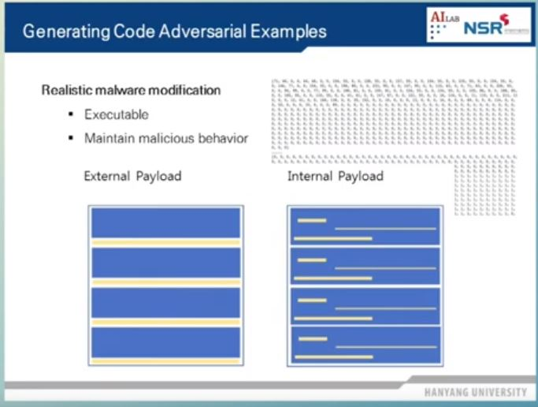

해당 영상은 Adversarial Examples에 대한 내용을 다룬다. 
 
기계학습의 목적 : Input과 Output 간의 관계성을 찾는 것
=> DNN, SVM 등의 매커니즘을 통해 Input과 Output 사이의 관계성을 쉽게 설명할 수 있게 되었다. 
 
## Adversarial Examples 적용 분야
#### 1. Computer Vision
이미지의 모든 부분을 변조할 수 있기 때문에 적용하기 쉽다.
#### 2. Text Classification, Text 인식
오동작을 발생시키는 문장, 단어 삽입하거나 기존의 단어를 commonly misspelled words로 변조하여 해당 글이 다른 분야의 글로 분류되도록 한다.
#### 3. Adversarial Music
e.g. 아마존 알렉사 Device를 오동작 시키는 음악 생성  
#### 4. Malware Detection
악성코드를 분류하는 (1D, 2D) CNN 모델이 오동작하도록 악성코드 변조  
=> 실행 가능성과 기존의 행위를 유지하면서 변조를 해야 하기 때문에 어렵다.  
##### 방법1 : External Payload
아래의 그림과 같이 코드의 뒷 부분에 악성코드를 변조하는 부분을 붙인다.  
=> 원하는 만큼 코드를 늘릴 수 있어서 변조가 용이하지만 코드의 길이가 원래보다 늘어났기 때문에 탐지가 쉽다.
##### 방법2 : Internal Payload
프로그램의 실행 및 기능에 영향을 주지 않는 부분 변조
(e.g. String이 저장되어 있는 영역 등)

 
Adversarial Examples 생성을 통해 Model Decision Boundary (기계학습을 통해 찾아낸 분류 Boundary) 뿐만 아니라 Task Decision Boundary (기계학습이 아닌 V3, 카스퍼스키와 같은 분류 문제를 해결하는 기존의 시스템이 찾아낸 Boundary)도 속일 수 있다. 즉, A.I를 (Adversarial Examples) 매개체로 해서 기존 시스템 공격을 자동화 할 수 있다. (e.g. Adversarial Examples를 Malware Detection에 적용했을 때 어베스트나 카스퍼스키 등에 대해서 오탐률이 10% 정도 증가했다.) 
  
White Box Attack에 성공하면 이를 Black Box Attack에도 적용할 수 있다. (Transferability of Adversarial Examples) 방법은 다음과 같다. 모델 A의 내부 구조를 모르는 상태에서 Input을 넣고 그에 대한 Output을 얻는다. Input, Output 쌍을 이용해 우리가 만든 모델 B를 학습시킨다. 그 뒤 모델 B를 속이는 Adversarial Examples를 생성한다. 해당 Adversarial Examples는 모델 A에도 적용 가능하다.
  
기계 학습의 Transferability  
=> 데이터의 도메인이 비슷하면 데이터가 똑같지 않더라도 유사하게 연관된 작업을 잘 수행한다.

  
###### 유투브 링크 : [2019 SW 안전 국제 컨퍼런스 - 기계학습 방법론의 취약성 분석 (이상근 한양대 교수)](https://www.youtube.com/watch?v=aho30FijZQc)

