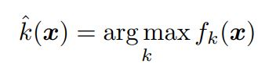

이게 있어야되나
<br/><br/>

## DeepFool for binary classifier
multiclass classifier는 binary classifier의 모음으로 볼 수 있기 때문에 우선 binary classifier에 대한 알고리즘을 분석하고 이를 확장한다. <br/>

다음과 같은 함수를 정의한다. 여기서 f는 임의의 스칼라 값을 출력하는 이미지 분류 함수이다. (f : R^n -> R) <br/>

<br/>
우선 f가 affine classifier인 경우를 분석하고 이로부터 미분 가능한 binary classifier에 적용할 수 있는 일반화된 알고리즘을 도출한다. <br/> 
(f(x) = W^T * x + b) <br/>

f가 affine function인 경우 x\_0에 대한 f의 robustness는 아래의 그림에서 x\_0와 seperating affine hyperplane *F* 사이의 거리로 볼 수 있다. (*F* = {x : w^T * x + b = 0}) <br/>

###### Adversarial examples for a linear binary classifier

classifier의 분류 결과를 바꾸는 최소의 perturbation은 x\_0에서 *F*로의 orthogonal projection에 해당한다. orthogonal projection은 다음과 같은 식을 통해 구할 수 있다. <br/>
```
r(x_0) := arg min ||r||_2 subject to sign(f(x_0+r) != sign(f(x_0)) = -f(x_0) * w / (||w||_2)^2
```
###### Eq. (3)
위 식은 ```f(x_0) = w^T*x + b```와 ```w^T(x_0+r) + b = 0```으로부터 도출할 수 있다. <br/>

이제 f가 일반적인 미분 가능한 binary classifier인 경우에 대해 살펴보자. 우리는 x\_0에 대한 최소의 perturbation을 구하기 위해서 iterative procedure를 사용한다. 각 iteration 마다 f는 현재 포인트인 x\_i에서 선형화된다. 그리고 선형화된 classifier에 대한 최소의 perturbation은 다음과 같이 구할 수 있다.

###### Eq. (4)
iteration i에서 perturbation r\_i는 Eq. (3)의 해를 이용해 구할 수 있다. 알고리즘은 x\_i+1이 classifier의 sign 값을 바꿀 때 종료한다. binary classifier들에 대한 DeepFool 알고리즘은 다음과 같다.

<br/>
실제로 위 알고리즘은 보통 *F*의 zero level set 지점에 수렴한다. classification boundary의 반대편으로 가기 위해서 최종 perturbation vector r^에 1 + η을 곱한다. ( η << 1, 여기서 η는 0.02로 설정했다.)

## DeepFool for multiclass classifiers
여기에서는 DeepFool 방식을 multiclass case에 확장한다. multiclass classifier에 주로 사용되는 방식은 one-vs-all 방식이다. 따라서 one-vs-all 방식을 사용하는 multiclass classifier를 가정한다. 이 classifier는 class의 개수 만큼의 output을 갖는다. 따라서 classifiers f는 R^n -> R로 정의된다. 또한 분류는 다음과 같은 mapping에 따라 수행된다. <br/>

###### Eq. (5)
위의 Eq. (5)에서 f\_k(x)는 k번째 class에 대응되는 f(x)의 output이다. 
<br/>

### Affine multiclass classifier
binary의 경우와 마찬가지로 linear case에 대해 접근 방식을 제시하고 다른 classifier에 대해 일반화한다. 
<br/>

f(x)를 affine classifier라 가정한다. 즉 f(x) = W^T * x + b 이다. 최소의 perturbation은 다음과 같다.

###### Eq. (6)
위의 Eq. (6)에서 w\_k는 W의 k번째 열에 대응된다. 
<br/>

기하학적으로, 위의 문제는 x\_0와 convex polyheron P의 여집합 사이의 거리를 계산하는 것과 동일하다. 이 거리를 dist(x\_0,P^c)라 나타낸다. (x\_0는 P 내부에 위치한다.)

###### Eq. (7)
polyheron P는 f가 label k^(x\_0)를 출력하는 공간을 정의한다. 

###### Figure 4: For x\_0 belonging to class 4, let *F\_k* = {x : f\_k(x) - f\_4(x) = 0}. These hyperplanes are depicted in solid lines and the boundary of P is shown in green dotted line.
Eq. (6)에 대한 답은 다음과 같이 계산할 수 있다.
우선 l^(x\_0)를 P의 boundary 중 가장 가까운 hyperplane으로 정의하고 이 값은 Eq (8)을 통해 구할 수 있다. (Figure 4에서 l^(x\_0)는 3이다.) 
<br/>

###### Eq. (8)
최소의 perturbation r\_*(x\_0)는 x\_0를 l^(x\_0)에 해당하는 hyperplane에 project한 벡터에 해당한다. 
즉,  r\_*(x\_0)는 Eq. (9)에 해당한다. 
<br/>

###### Eq. (9)

### General classifier
이제 DeepFool 알고리즘을 일반적인 미분 가능한 multiclass classifier로 확장한다. 일반적인 비선형 classifier에 대해서 위에서 정의한 집합 P는 더 이상 polyhedron이 아니다. iterative linearization procedure를 통해서 집합 P를 iteration i에서 polyhderon P˜\_i로 근사한다.

###### Eq. (10)
iteration i에서 x\_i와 P의 여집합과의 거리를 dist(x\_i,P˜\_i) 로 근사한다. 
<br/>

multiclass classifier에 대한 DeepFool 알고리즘은 다음과 같다. 

<br/>

제안된 알고리즘은 greedy한 방식으로 동작하고 실제 최소의 perturbation에 수렴하지 않을 수도 있다. 하지만 실제로 위의 알고리즘을 통해 찾은 perturbation은 매우 작아서 최소의 perturbation에 잘 근사한 값에 해당한다고 이 논문에서는 주장한다. 
<br/>


 
