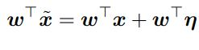
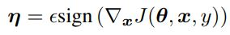
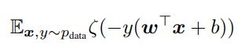
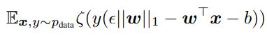
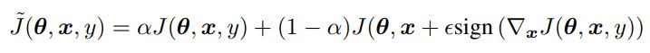
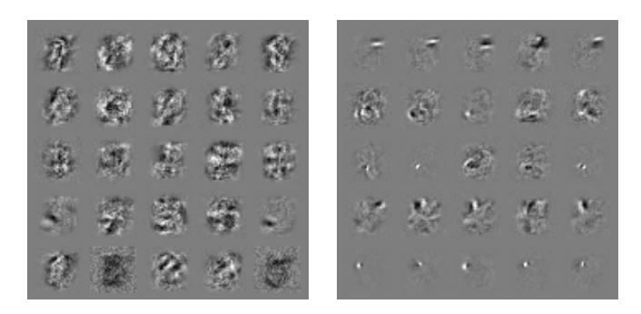
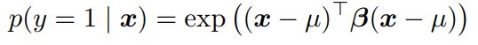
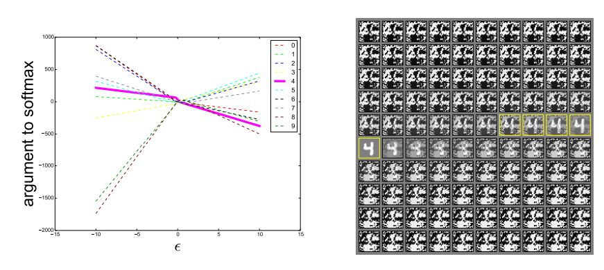

이 논문 이전에는 neural network의 adversarial examples에 대한 취약성을 비선형성과 과적합으로 설명하려고 했다. 하지만 여기에서는 neural network의 선형한 성질을 그 원인이라 주장한다. 이 주장은 adversarial examples이 architecture와 (neural network의 구조) training set과 관계없이 적용되는 이유에 대한 설명을 제공한다. 또한 간단하고 빠르게 adversarial examples를 생성하는 방법을 제시한다. (Fast Gradient Sign Method)

## Introduction
많은 경우 adversarial example은 서로 다른 training data로 훈련된 모델이나 서로 다른 architecture의 모델에 대해서 동일하게 적용된다. 이는 adversarial example이 훈련 알고리즘의 근본적인 맹점을 드러냈다고 볼 수 있다. 
 

이전까지는 adversarial example의 원인을 DNN의 비선형성으로 추측했다. (\+ 모델의 불충분한 averaging과 regularizaion) 하지만 이 논문에서는 high dimensional space에서의 선형성이 adversarial example을 원인이라고 주장한다. 이러한 관점은 adversarial examples를 빠르게 생성하는 방법을 제시한다. 
 

이러한 주장은 훈련을 쉽게 하기 위해서 모델을 선형적으로 설계하는 것과 adversarial perturbation에 잘 견디게 하기 위해서 모델을 nonlinear하게 설계하는 것 사이의 근본적인 tension을 제시한다. (dropout, pretraining, model averaging과 같은 일반적인 regularization은 모델의 adversarial examples에 대한 취약성을 줄이지 못하지만 비선형 모델로 변경하는 것은 해당 취약성을 줄인다.)

## Related Work
**Intriguing properties of neural networks** 에서는 다음과 같은 neural network의 흥미로운 성질을 발견했다. 
1. Box-constrained L-BFGS를 통해 adversarial example을 생성할 수 있다. 
2. 어떤 dataset에 대해서는 adversarial example이 원본 data와 매우 유사해서 사람이 그 차이를 구분할 수 없다. 
3. 동일한 adversarial example은 서로 다른 구조의 모델이나 서로 다른 데이터로 훈련된 모델에 대해서 적용된다. 
4. shallow softmax regression 모델도 adversarial examples에 취약하다.
5. adversarial example을 이용해 훈련을 하면 model을 regularize할 수 있다. (위 논문에서는 adversarial example을 생성하는데 드는 비용이 많았기 때문에 실용적이지 못했다.)

위 결과는 머신러닝 기술이 올바른 출력 label을 결정하는 근본적인 개념을 습득하지 못했음을 의미한다. (자연스럽게 발생하는 데이터는 잘 구분하지만 데이터 분포에서 낮은 가능성을 갖는 데이터는 잘 구분하지 못한다.)

## The Linear Explanation of Adversarial Examples
우선 linear model에 adversarial example이 존재하는 것에 대해 설명한다. 
 

각 input feature의 정밀도에 한계가 존재한다. 예를 들어 디지털 이미지는 픽셀을 8bit로 표현하기 때문에 1 - 255 범위 밖의 값들은 버린다. 따라서 classifier는 input x와 x˜ = x + η (η의 모든 요소는 feature의 정밀도 보다 작은 값) 에 대해서 동일한 output을 출력해야 한다. 즉, ||η||_∞ < ε  인 경우  classifier는  x와 x˜를 동일한 label로 분류해야 한다. (ε는 input feature의 정밀도 보다 충분히 작은 값)
 

weight 벡터 w와 adversarial example x˜의 dot product는 다음과 같다.
 

 
adversarial perturbation은 activation을 w^T * η 만큼 증가시킨다. η에 sign(w)를 할당함으로써 위의 max norm constraint를 만족하면서 activation의 증가량을 최대화 할 수 있다. w가 n dimension을 갖고, weight 벡터 요소의 평균 값이 m 이라고 할 때 증가량은 εmn이다.
 
**w의 dimension이 증가하면 ||η||_∞ 의 값은 영향을 받지 않지만 activaion의 증가량은 n에 선형하게 증가한다. 따라서 높은 dimension에서는 input의 극미한 변화가 output에 큰 변화를 일으킬 수 있다.**  
 
위의 설명을 통해 단순한 linear 모델도 input이 충분한 dimension만 갖는다면 adversarial example을 갖을 수 있음을 알 수 있다. 이러한 선형성에 근거한 가설을 통해 softmax regression이 adversarial example에 취약한 이유를 설명할 수 있다. 

## Linear Perturbation of Non-linear Models
adversarial example에 대한 선형적인 관점을 이용하면 adversarial example을 만들어내는 빠른 방법을 찾을 수 있다. 이를 위해서 일단 neural network가 매우 선형적이어서 선형적인 adversarial perturbation에 취약하다고 가정한다. 실제로 LSTM, ReLU, maxout network는 모두 선형적인 방식으로 동작하도록 설계되었다. 이는 최적화를 쉽게 하기 위함이다. 또한 sigmoid와 같은 비선형 모델은 최적화를 쉽게 하기 위해서 non-saturating하고 선형적인 영역에서 대부분의 시간을 사용한다. (saturating \: w의 학습이 이루어지지 않는 상태)
 

linear한 동작은 linear 모델의 비용이 적게 들고, 분석적인 perturbation이 neural network에도 적용됨을 의미한다. θ는 모델의 parameter를 의미하고, x는 input, y는 x와 관련된 target을 의미한다. 그리고 J(θ,x,y)는 neural network를 훈련하기 위한 cost function을 의미한다. 다음과 같이 cost function을 θ에서 선형화함으로써 최적의 max norm constrained perturbation을 얻을 수 있다. 
 

 
위의 방식을 fast gradient sign method라고 한다. 
 

neural network가 선형적으로 동작할 것이라 가정
 
=> η가 매우 작아도 dimension이 커짐에 따라 cost function의 값의 변화량이 매우 커진다. 
 

이 단순한 알고리즘이 잘못 분류된 예제를 생성할 수 있다는 사실은 adversarial example이 선형성의 결과라는 주장에 증거가 된다. 

## Adversarial Training of Linear Models Versus Weight Decay
간단한 모델 중 하나인 logistic regression에 대해 살펴보자. 이를 통해 간단한 환경에서 adversarial examples이 어떻게 생성되는지에 대한 직관을 얻을 수 있다. 
 

출력 label y은 {-1,1} 의 값을 갖고 P(y=1) = σ(w^T * x + b)인  logistic regression 모델을 가정하자. (σ(z)는 logistic sigmoid 함수) 해당 모델은 아래의 함수에 대한 gradient descent을 통해 학습한다. 
 

 
ζ(z) = log (1 + exp(z)) 는 softplus 함수이다.
 

위의 함수에 대한 gradient의 sign 값은 -sign(w)이고 w^T * sign(w) = ||w||_1 이기 때문에 x의 adversarial perturbation에 대한 훈련은 아래의 식을 최소화 하는 것이다.
 

 

이는 L1 규제와 비슷한 형태인데 큰 차이점이 존재한다. 우선 L1 규제는 훈련하는 동안 모델의 activation에서 L1 규제를 빼고, adversarial training은 값을 더한다. 
 

여기서부터 잘 이해 안가는 내용
 

즉, L1 규제는 모델의 ζ가 충분히 saturation됐을 때 사라지는 것을 의미한다. 이는 underfitting 영역에서 adversarial training이 단순히 underfitting을 악화시킬 수 있음을 보장하지는 않는다. 따라서 L1 규제는 margin이 좋은 경우 비활성화되지 못하기 때문에 adversarial training 보다 안 좋은 기법이다. (margin : data point과 decision boundary 사이의 거리)
 

multiclass softmax regression의 경우 L1 규제는 성능이 더 안 좋다. L1 규제는 softmax의 출력이 독립적으로 perturbable 하다고 취급한다. 하지만 일반적으로 모든 class의 weight vector와 일치하는 단일 η를 찾기는 불가능하다. Wight Decay는 perturbation을 통한 damage를 과대평가 하기 때문에 feature의 정밀도와 관련된 ε 보다 더 작은 L1 규제 계수를 사용한다. MNIST에 대한 maxout network를 훈련할 때 adversarial training은 ε를 0.25로 설정해서 좋은 결과를 얻었지만, L1 규제를 사용할 때는 계수를 0.0025도 너무 큰 값이어서, training set에 대한 error rate가 5%가 넘었다. 더 작은 L1 계수는 성공적인 훈련 결과를 만들어 냈지만 규제 효과는 얻지 못했다.

## Adversarial Training of Deep Network
DNN이 adversarial examples에 취약하다는 주장은 어느 정도 잘못된 것이다. shallow linear model과 다르게 DNN은 adversarial perturbation을 잘 견디는 함수를 나타낼 수 있기 때문이다. universal approximator thorem은 적어도 하나의 hidden layer를 갖는 neural network가 충분한 unit을 갖으면 어느 정도 정확도를 갖는 함수를 표현할 수 있음을 보장한다.
 

하지만 universal approximator thorem은 훈련 알고리즘이 원하는 특성을 갖는 함수를 찾는 것을 보장하지는 않는다. 그리고 일반적인 지도 학습 훈련은 adversarial example을 잘 견디는 함수를 찾지 못한다. 따라서 adversarial example을 잘 견디는 함수를 찾기 위한 과정이 훈련 과정에 포함되어야 한다. 
 

Intriguing properties of neural networks 논문에서 adversarial examples와 clean examples를 섞은 것에 대해 훈련을 하면 neural network에 규제 효과를 가져오는 것이 밝혀졌다. adversarial examples에 대해 훈련하는 것은 일반적인 data augmentation 방식과 다르다. 일반적인 data augmentation은 test set에 있음직하게 data를 변형시킨다. 하지만 adversarial examples는 일반적으로 발생할 것 같지는 않지만 모델이 decision 함수를 개념화하는 방식에 있는 결함을 드러내는 데이터를 생성한다. 
 

fgsm에 기반한 adversarial objective function에 대해 훈련하면 효과적인 규제 효과를 얻을 수 있다. 
 

 

이 방식은 adversarial examples를 지속적으로 공급한다. dropout을 사용한 maxout network에 대해서 위의 objective function을 사용하면 error rate가 0.94에서 0.84%로 감소했다.
 

위의 objective function을 사용한 결과 adversarial examples에 대해 어느 정도 견디는 모델이 되었다. adversarial training을 사용하면 그렇지 않은 경우보다 adversarial examples에 대한 error rate가 17.9% 감소했다. 
 
또한 Fig. 3과 같이 weight가 많이 바꼈다. adversarial training을 사용한 경우 weight가 더 localized되고 interpretable 하게 됐다.
 

###### Figure 3: Weight visualizations of maxout networks trained on MNIST. Each row shows the filters for a single maxout unit. L eft) Naively trained model. Right) Model with adversarial training.
adversarial training 과정은 공격자에 의해서 data가 변조됐을 때 worst case error를 최소화 하는 것이라고 볼 수 있다. 이는 input에 U(-ε,ε) 크기의 노이즈가 추가됐을 때 cost 값의 상한을 최소화 하는 것이다. 또한 adversarial training은 모델이 새로운 point에 대해서 label을 요청하는 것으로 볼 수 있다. 이 경우 human labeler가 근처의 point에 대해서 label을 복사하는 heuristic labeler로 대체된다. 
 

우리는 ε max norm box 내에 있는 모든 포인트에 대해서 훈련을 함으로써 정밀도 ε 보다 작은 feature 변화에 대해서 무감각한 모델을 만들 수 있다. 이는 훈련을 하는 동안 max norm ε 크기의 노이즈를 추가하는 것과 같다. 하지만 zero mean, zero covariance한 노이즈는 adversarial examples를 막을 수 없다. 즉, 대부분의 경우 노이즈는 효과가 거의 없다. 실제로 노이즈는 더 낮은 objective function 값을 출력한다. adversarial training은 분류에 저항하는 noisy point만 사용해서 효율적으로 훈련하기 위해 noisy한 input set에서 어려운 example을 찾아내는 것이라고 할 수 있다. 대조 실험을 위해서 각 픽셀에 랜덤하게 ±ε을 더한 maxout network와 각 U(-ε,+ε)의 노이즈를 더한 maxout network에 대해서 훈련을 진행했다. 그 결과 adversarial examples에 대해서 error rate가 각각 86.2%, 90.4%가 나왔다. 
 

sign 함수의 미분 값은 0 또는 undefined이다. 따라서 adversarial objective function은 모델이 공격자가 parameter의 변화에 어떻게 대응할지를 예상하지 못하게 한다. 작은 회전이나 scaled gradient를 더한 adversarial example에 대해서는 미분 가능하기 때문에 학습이 공격자의 반응을 고려할 수 있다. 따라서 이러한 방식들은 효과적인 규제 효과를 얻을 수 없다. 
 

저자의 관점에서 adversarial training은 모델이 adversarial examples에 저항할 만큼의 capacity를 갖을 때만 유용하다. 즉, universal approximator theorem이 적용되는 경우에만 유용하다는 의미이다. 

## Different Kinds of Model Capacity
adversarial examples의 존재가 반직관적인 이유는 우리의 높은 차원의 공간에 대한 직관의 부족함 때문이다. 우리는 3차원의 공간에 살기 때문에 수 백개의 공간에서 작은 효과가 더해져서 하나의 큰 효과가 되는 것에 익숙하지 않다. 우리의 직관이 부족한 곳이 또 있는데, 많은 사람들은 모델의 capacity가 작으면 confident한 예측을 하지 못할 것이라고 생각한다. 하지만 아래와 같은 shallow RBF network는 µ 근처에 positive class가 존재하는 것을 confident하게 예측할 수 있다. 
 

 

또한, RBF network는 기본적으로 class가 없다고 예측하거나 low-confidence 예측을 한다. RBF network는 network가 속여졌을 때 low confidence한 예측을 한다는 점에서 adversarial example에 영향을 받지 않는다고 할 수 있다. hidden layer가 없는 shallow RBF network는 MNIST를 이용한 adversarial examples에 대해 error rate가 55.4%였다.  (ε = .25) 하지만 그때 잘못 예측한 경우에 대해서 confidence는 1.2%였다. RBF network의 clean test example에 대한 평균 confidence는 60.6%이다. 위와 같이 capacity가 작은 모델은 모든 포인트에 대해서 정확한 예측을 하지는 못하지만, 이해하지 못한 포인트에 대해서는 confidence를 줄임으로써 적절히 반응한다. 
 

RBF unit은 중요한 변환에 따라 변화하기 때문에 generalize를 잘 못한다. linear unit은 특정 방향으로 모든 input에 대해서 반응함으로써 높은 recall을 얻지만, 경험이 없는 상황에서 너무 강하게 반응하기 때문에 precision이 낮다. 반면, RBF unit은 특정 포인트에서만 반응을 하기 때문에 precision이 높지만, recall이 낮다. 이러한 결과를 활용해서 quadractic unit을 포함하는 모델에 대해 살펴봤다. 하지만 이러한 경우 adversarial exampels에 대해 잘 저항하지만 training set error가 너무 높았다.
## Why Do Adversarial Examples Generalize?
adversarial example의 흥미로운 점은 하나의 모델에서 생성된 example이 다른 architecture를 갖거나, 다른 training set에서 훈련된 모델에서도 잘못 분류된다는 점이다. 그리고 잘못 분류됐을 때 보통 각 모델들은 example을 동일한 class로 분류한다. 이를 non-linearity와 overfitting으로 설명하려고 하면 설명이 잘 안된다. 매우 큰 capacity를 갖은 non-linear 모델이 분포 외부에 있는 데이터를 일관되게 동일한 class로 분류하는 것이 설명이 되지 않는다. 또한 이 관점에서 adversarial example은 일반적이지만 매우 정확한 (정밀한) 지점에서만 발생한다.
 

linear 관점에서 보면 adversarial example은 매우 넓은 공간에서 발생한다. η의 방향은 cost function의 gradient와 dot product 했을 때 양수이기만 하면 된다. 그리고 ε는 충분히 큰 값만 갖으면 된다. 이는 Fig. 4를 통해 확인할 수 있다. 서로 다른 ε의 값에 대해 살펴봤을 때 adversarial example이 fgsm에 의해 정의된 1차원 공간의 인접한 영역에서 발생하는 것을 볼 수 있다. 이를 통해 adversarial example가 많이 존재하고, 하나의 모델에서 잘못 분류되는 adversarial example이 왜 높은 확률로 다른 모델에서도 잘못 분류되는지가 설명된다.   
 

###### Figure 4: By tracing out different values of ε, we can see that adversarial examples occur reliably for almost any sufficiently large value of ε provided that we move in the correct direction. Correct classifications occur only on a thin manifold where x occurs in the data. Most of R^n consists of adversarial examples and rubbish class examples (see the appendix). This plot was made from a naively trained maxout network. Left) A plot showing the argument to the softmax layer for each of the 10 MNIST classes as we vary ε on a single input example. The correct class is 4. We see that the unnormalized log probabilities for each class are conspicuously piecewise linear with ε and that the wrong classifications are stable across a wide region of ε values. Moreover, the predictions become very extreme as we increase ε enough to move into the regime of rubbish inputs. Right) The inputs used to generate the curve (upper left = negative ε, lower right = positive ε, yellow boxes indicate correctly classified inputs).
왜 서로 다른 classifier가 adversarial example를 동일한 class로 분류하는지를 설명하기 위해서 현재의 방식으로 훈련된 neural network는 동일한 training set에서 훈련된 linear classifier와 비슷하다고 추측했다. neural network들은 머신러닝 알고리즘이 generalize하는 특성이 있기 때문에 서로 다른 training set에 대해서 훈련되어도 비슷한 weight를 갖게 된다. 따라서 이러한 근본적인 분류 weight의 안정성은 adversarial example의 안정성을 가져온다. 
 

위의 추측을 테스트하기 위해서 deep maxout network에서 adversarial example을 생성하고 이를 shallow softmax network와 shallow RBF network에서 분류해봤다. maxout network와 RBF network가 동시에 잘못 분류한 example에 대해서 분류 class는 54.3% 겹쳤다. 그리고 RBF network와 softmax networks는 53.6% 겹쳤다. 반면, softmax classifier의 분류는 maxout network의 분류와 84.6%가 겹쳤다. 이를 통해서 모델들의 선형성이 cross-model generalization의 원인임을 알 수 있다.
## Summary and Discussion
- adversarial examples는 high-dimensional dot product 특성으로 설명할 수 있다. adversarial examples는 모델의 선형성 때문에 발생한다.
- adversarial examples의 generalization은 서로 다른 모델이 동일한 작업을 하면 비슷한 function을 학습하는 것으로 설명할 수 있다. 즉, 서로 다른 모델이 비슷한 wegith vector를 갖고, adversarial example은 모델의 weight vector에 따라 생성되기 때문이다.
- adversarial example은 input space의 특정한 point에 위치하는 것이 아니라 perturbation의 방향에 따라 넓은 공간에 존재한다.
- perturbation의 방향이 핵심이기 때문에 adversarial perturbation은 서로 다른 clean example에 대해서 generlize하다. (universal perturbation의 존재를 의미하는건가???)
- adversarial training은 규제 효과가 있다. (이 규제 효과는 L1 규제나 단순히 noise를 더해서 학습하는 것보다 효과적이다.)
- 최적화하기 쉬운 모델은 perturb하기 쉽다.
- linear model은 adversarial perturbaiton에 저항할 capacity가 부족하다. universal approximator theorem이 적용되는 hidden layer를 갖은 구조는 adversarial perturbation에 저항하게 학습할 수 있다.
- RBF network는 adversarial examples과 rubbish class examples에 저항한다.
- Ensemble은 adversarial example을 막는데 별 효과가 없다.

adversarial examples의 존재는 training data나 test data를 정확히 분류하는 모델이라고 해도 분류하는 작업을 완전히 이해하지 못했다는 것을 의미한다. 그리고 이러한 선형성을 갖는 모델은 데이터 분포에서 발생하지 않는 포인트에 대해서도 과하게 확신을 가지고 잘못된 예측을 한다.
