DNN은 표현력이 뛰어난 모델으로 음성 및 이미지 인식에서 좋은 성능을 보여준다. 하지만 이러한 표현력 때문에 직관에 반하는 특성을 갖는 해석 불가능한 솔루션을 학습하게 된다. 이 논문에서는 다음과 같은 특성들에 대해 다룬다.
- 개별 unit들과 unit들의 랜덤 선형 조합에는 차이가 없다. 즉, neural network의 layer에 담겨있는 의미 정보를 포함하는 것은 개별 unit보다는 공간이다.
- DNN은 매우 불연속적인 input-output 매핑을 학습한다. 따라서 매우 작은 크기의 perturbation을 이미지에 더함으로써 DNN이 이미지를 잘못 분류하게 할 수 있다. 

## 1. Introduction
neural network는 약간의 대규모 병렬 비선형 step으로 임의의 연산을 표현할 수 있기 때문에 좋은 성능을 갖는다. 하지만 표현된 연산이 지도 학습을 통한 역전파에 의해서 도출되기 때문에 해석하기가 어렵고 직관에 반하는 특성을 갖는다. 이 논문에서는 DNN의 반직관적인 두 가지 특성들을 다룬다. 
 

첫 번째 특성은 개별 unit의 의미와 관련있다. 이전에는 특정 unit을 최대로 활성화시키는 input 집합을 찾음으로써 unit의 의미를 분석했다. 개별 unit 검사는 마지막 feature layer에 있는 unit이 의미 정보를 추출하는데 유용한 기저를 형성한다는 가정을 한다. 이 논문에서는 φ(x)의 random projection이 φ(x)의 좌표와 의미상 동일하다는 것을 보여준다. 이는 neural network가 좌표 공간에서 차이 요소를 구분한다는 가정에 의문을 제기한다. 일반적으로 대부분의 의미 정보를 포함하는 것은 개별 unit이 아닌 activation의 전체 공간이다. 즉, 개별 unit의 벡터 표현은 의미 정보를 포함하지 않는다. 
 

두 번째 특성은 neural network의 perturbation에 대한 안정성과 관련있다. 우리는 작은 perturbation이 input 이미지의 카테고리를 바꿀 수 없기 때문에 neural network가 작은 perturbation에 잘 대응할 것이라고 생각한다. 하지만 이 논문에서는 작은 perturbation을 통해 모델의 예측을 마음대로 바꿀 수 있음을 확인했다. 이 perturbation은 모델의 prediction error를 최대화하도록 input을 최적화함으로써 찾을 수 있다. 이렇게 생성된 perturbed example을 adversarial example이라 부른다.
 

adversarial example은 비교적 robust해서 하나의 adversarial example은 서로 다른 neural network에 대해서 적용된다. 
 

이러한 특성은 역전파를 통해 학습하는 DNN이 비직관적인 특성을 갖고 있다는 것을 의미한다. 그리고 불분명한 방식으로 데이터 분포와 연결되어 있는 DNN이 본질적으로 맹점이 있다는 것을 의미한다.

## 2. Framework
**Notation** 
 
input 이미지를 x ∈ R^m으로 표기하고 layer의 activation  값을  φ(x) 로 표기한다. 처음에는 이미지의  φ(x)와 관련된 특성에 대해 분석하고 그 다음에 neural network의 맹점에 대해 알아본다. 
 

몇 가지 서로 다른 network와 세 종류의 dataset에 대해서 실험을 진행한다. 
- MNIST dataset
    - 하나 또는 여러 개의 hidden layer를 갖는 fully connected network와 softmax classifier. 이 network를 FC라고 부른다.
    - top에 autoencoder가 있는 모델. 이를 AE라고 부른다.
- ImageNet dataset
    - AlexNet 
- 유투브에서 얻은 10M 이미지 샘플
    - 비지도 학습으로 훈련한 network. 이를 QuocNet이라고 부른다. 
MNIST dataset을 사용한 모델은 규제로 weight decay를 사용했다. 그리고 특정 실험에서는 MNIST dataset을 서로 다른 두 개의 훈련 데이터로 분리해서 사용했다. (훈련 데이터는 각각 30000개로 구성된다.)

## 3. Unit of: φ(x)
이전 연구에서는 hidden unit의 activation을 의미있는 feature로 해석하고 단일 feature의 activation 값을 최대화하는 input 이미지들을 찾았다. 이는 다음의 식을 만족하는 x`를 찾는 것으로 표현할 수 있다.
 
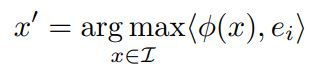
 
위의 식에서 I는 모델의 훈련에 사용되지 않은 이미지 데이터 집합을 의미하고, e_i는 i번째 hidden unit과 관련된 natural basis vector를 의미한다. 따라서 위의 식은 i번째 unit의  output을 최대로 하는 이미지를 찾는다. 
 

실험에서 random directon v ∈ R^n도  natural basis vector와 비슷하게 해석 가능한 의미있는 특성을 도출하는 것을 볼 수 있다. 즉, 다음과 같은 식을 통해 찾은 이미지 x`들은 의미적으로 서로 연관되어 있다. 
 
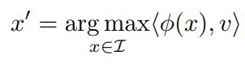
 
이는 neural network가 좌표 공간에서 차이 요소를 구분한다는 생각에 의문을 제기한다. 
 

MNIST에 대해 훈련한 CNN에 대해서 이를 적용해봤다. I로 MNIST의 test 데이터를 이용했다. Figure 1을 natural basis의 activation 값을 최대화하는 이미지들을 보여준다. 그리고 Figure 2는 random direction의 activation을 최대화하는 이미지들을 보여준다. 두 경우 다 결과로 나온 이미지들이 유사성을 가지고 있다. 
 
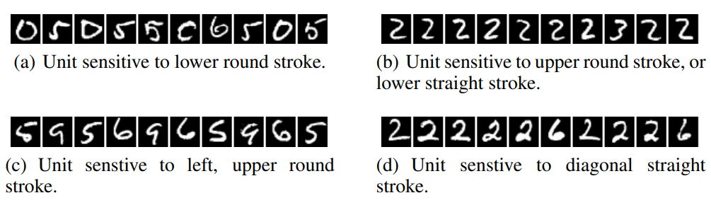
###### Figure 1: An MNIST experiment. The figure shows images that maximize the activation of various units (maximum stimulation in the natural basis direction). Images within each row share semantic properties.
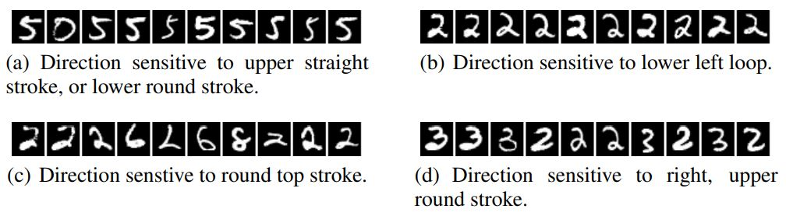
###### Figure 2: An MNIST experiment. The figure shows images that maximize the activations in a random direction (maximum stimulation in a random basis). Images within each row share semantic properties.
동일한 실험을 AlexNet에 진행한 결과 single unit과 unit들의 조합의 activation 값을 최대화하는 이미지들은 의미적으로 유사한 성질을 가지고 있었다.
 

이러한 분석이 input distribution의 특정 부분 집합에 대해서 불변하는 φ의 capacity에 대한 이해를 제공하지만, 나머지 영역에서의 행동에 대해서는 설명하지 못한다. 다음 섹션에서는 φ가 data distribution point의 근처에서 직관에 반하는 특성이 있음을 보여준다.

## 4. Blind Spots in Neural Networks
지금까지 unit 수준의 검사 방법은 DNN에 의해 학습된 표현의 복잡성과 관련한 특정 직관을 확인하는 것 외에는 유용성이 거의 없었다. 전체 network 수준의 검사 방법은 모델의 분류 결정을 설명하는데 유용하다. 예를 들어 input의 어떤 부분이 올바른 분류에 영향을 미치는지 식별하는데 이용될 수 있다. 이러한 전체 network 수준의 분석은 모델의 input\-output 매핑을 더 잘 이해할 수 있게 만든다는 점에서 유용하다.  

일반적으로, neural network의 output layer unit은 input의 비선형 함수이다. neural network의 output unit과 input 사이에 있는 비선형 층의 deep stack은 모델이 input space에 대한 non-local generalization을 인코딩하는 방법이라고 주장된다. 
 

위의 주장에는 training example과 근접한 영역에 대한 local generalization는 예상대로 작동한다는 것을 내포하고 있다. 매우 작은 반지름 ε > 0 과 input x에 대해서, x + r (||r|| <  ε) 은 모델에 의해서 올바르게 분류될 것이다. 이는 컴퓨터 비전 문제에도 유효하다. 일반적으로 인식하지 못할 만큼 작은 perturbtion은 image의 기존 class를 변경하지 못한다. 
 

하지만 이 논문의 주된 결과는 DNN의 경우 많은 kernel method의 기초가 되는 위의 가정이 적용되지 않는다는 것이다. 특히, 이 논문에서는 간단한 최적화 과정을 이용해서 adversarial example을 쉽게 찾을 수 있음을 보여준다. 
 

어떤 의미에서, 위의 행위는 network에 의해 표현된 manifold를 효율적인 방식으로 (최적화를 통해) 돌아다니면서 input space에서 adversarial example을 찾는 것이다. adversarial examples는 manifold에서 낮은 확률의 영역 (pocket)에 해당한다. 따라서 단순히 input 근처에서의 랜덤 샘플링으로는 adversarial example을 찾기 힘들다. 

### 4.1. Formal description
이미지 픽셀 값 벡터를 label set에 맵핑하는 classifier를 f : R^m \-\> {1...k} 로 표기한다. 그리고 f의 손실함수를 loss_f : R^m X {1...k} \-\> R^+로 표기한다. 이미지 x ∈ R^m 와  label l ∈ {1...k}에 대해서 다음과 같은 box-constrained optimization을 풀고자 한다. 
- 다음의 조건을 만족하는 \|\|r\|\|_2를 최소화한다. 
    - f(x + r) = l
    - x + r  ∈ [0,1]^m

최솟값 r은 유일하지 않지만 D(x,l)를 통해 구한 임의의 최소값을 r로 표기한다. 일반적으로 D(x,l)의 정확한 계산은 어려운 문제이므로, box-constrained L-BFGS를 사용해서 근사값을 구한다. 즉, 이 논문에서는 D(x,l)의 근사값을 다음의 식을 만족하는 최소 c > 0 을 찾기 위한 line search로 찾는다.
- c\|r\| + loss_f(x + r,l) 을 최소화한다.

이 패널티 함수는 손실 함수가 convex하면 D(X,l)에 대한 정확한 해를 찾는다. 하지만 일반적으로 neural network는 non-convex하기 때문에 이 경우에는 구한 해가 근사값이 된다.

### 4.2 Experimental results
우리의 minimum distortion 함수 D 다음과 같은 흥미로운 특성을 갖는다. 
- 실험에 사용한 모든 network에 대해서 원본과 구분이 불가능할 정도로 비슷한 adversarial example을 생성할 수 있다.
- Cross model generalization : 비교적 많은 수의 adversarial example이 서로 다른 hyper parameter (층의 개수, 규제, 초기 weight 값)를 갖는 네트워크에도 적용된다.
- Cross training-set generalization : 비교적 많은 수의 adversarial example이 서로 다른 training set에 의해 훈련된 네트워크에 적용된다.

위의 특성은 adversarial example이 어느 정도 universal하고 특정 모델이나 training set에 overfitting한 결과가 아니라는 것을 의미한다. 또한 adversarial example로 모델을 다시 학습시키면 generalization을 향상시킬 수 있다는 것을 의미한다. MNIST에 대한 실험이 위의 가설을 뒷바침한다. 두 개의 층을 갖는 100-100-10 non-convolution neural network를 adversarial example을 섞은 training set으로 훈련한 결과 test error가 1.2% 밑으로 떨어졌다. 네트워크 훈련은 각 layer에 대해서 개별적으로 adversarial example pool을 update하면서 진행했다. 초기 결과를 통해서 input 이나 lower layer에 대한 adversarial example 보다 higher layer에 대한 adversarial exmaple이 훨씬 유용한 것을 알 수 있었다.
 

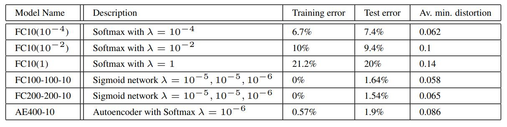
###### Table 1: Tests of the generalization of adversarial instances on MNIST. 

Table 1과 같은 정확도를 갖는 모델에 대해서 adversarial example을 생성하였다. 마지막 열은 trianing set에 대한 adversarial example의 정확도가 0%가 되기 위해 최소한의 평균 픽셀 distortion 값을 나타낸다. (이 값은 원본 이미지 픽셀 값과 adversarial example 픽셀 값 차이의 제곱을 픽셀 수로 나눈 것에 루트를 취해 구한다.)
 
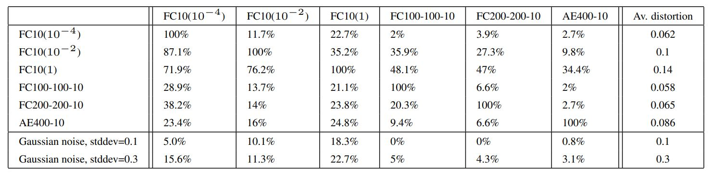
###### Table 2: Cross-model generalization of adversarial examples. The columns of the Tables show the error induced by distorted examples fed to the given model. The last column shows average distortion wrt. original training set.
Table 2는 각 모델에 대해서 생성한 adversarial example을 서로 다른 모델에 적용했을 때의 error rate를 나타낸다. 이를 통해서 adversarial example이 서로 다른 hyper parameter를 갖는 모델에 대해서도 적용됨을 알 수 있다.
 

cross-training-set generalization 실험해보기 위해서 60000개의 MNIST training 이미지를 30000개의 P1, P2로 나눴다. Table 3의 FC100-100-10은 동일한 hyper parameter를 사용했다. Table 3은 각 모델의 정확도를 나타낸다.
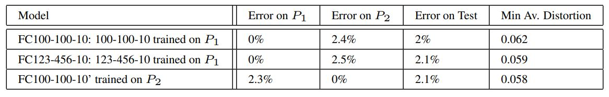
###### Table 3: Models trained to study cross-training-set generalization of the generated adversarial examples. Errors presented in Table correpond to original not-distorted data, to provide a baseline.
Table 4는 각 모델에서 생성된 adversarial example을 서로 다른 모델에 적용한 결과를 나타낸다. Table 4에서 사용된 adversarial example은 test set에 대해서 생성한 것이다. Table 4의 두 번째 표는 adversarial example을 x + 0.1 * (x\`\-x / \|\|x\`\-x\|\|_2) 로 확대한 뒤 적용했을 때의 결과를 나타낸다. 이 확대는 distortion을 평균 40% 확대했고, stddev를 0.06에서 0.1로 확대했다. 
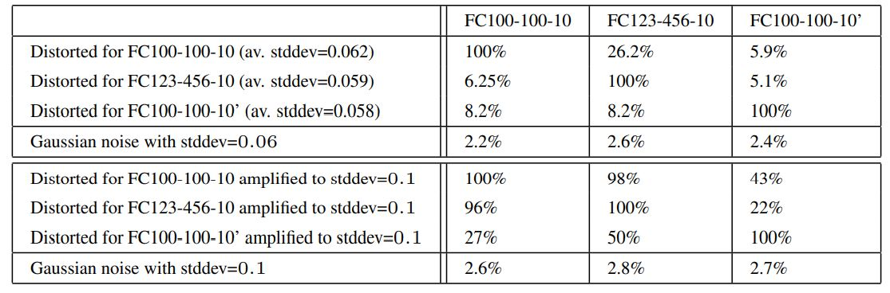
###### Table 4: Cross-training-set generalization error rate for the set of adversarial examples generated for different models. The error induced by a random distortion to the same examples is displayed in the last row.
위 실험의 결과를 통해 서로 다른 training set으로 훈련한 네트워크에도 adversarial example이 (효과는 상당히 감소하지만)  적용됨을 알 수 있다.

## 4.3 Spectral Analysis of Unstability
이 전 섹션에서는 지도 학습으로 훈련된 deep network가 독특한 형태의 small perturbation에 불안정한 것을 보여줬다. network와 training set에 대한 generalization 특성과 관계없이, adversarial example은 마지막 층의 output에 큰 변화를 일으키는 input에 대한 small perturbation이 존재함을 보여준다. 이 섹션에서는 각 rectified 층의 범위를 측정함으로써 network의 perturbatin에 대한 안정성을 측정하고 제어하는 과정에 대해 설명한다.
 

수학적으로 input x 및 훈련된 parameter W에 대응하는 K개의 층으로 구성된 network의 output φ(x)를 다음과 같이 표현할 수 있다. 
 

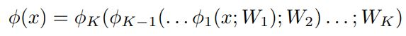
 

φk는 k-1 층에서 k층으로 매핑하는 연산자를 의미한다. φ(x)의 불안정성은 각 layer k = 1...K의 upper Lipschitz constant 구함으로써 알 수 있다.  L_k > 0 은 다음과 같이 정의된다. 
 

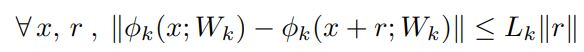
 

따라서 전체 네트워크는 ||φ(x) - φ(x + r)|| <= L||r|| 를 만족한다. (L = L_1 * L_2 * ... * L_k)
 

half-rectified 층은 φk(x;W_k,b_k) = max(0,W_k * x + b_k) 와 같이 정의한다. W의 operator norm을 ||W||로 표현한다. (즉, W의 largest singular value를 의미한다.) non-linearity p(x) = max(0,x) 는 contractive 하기 때문에 모든 x,r에 대해서 ||p(x) - p(x + r)|| <= ||r|| 을 만족한다. 또한 아래와 같은 식을 따른다.
 

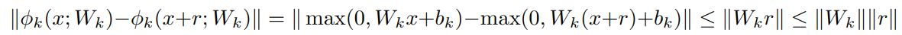
 

따라서 L_k <= ||W_k|| 이다.
 

max-pooling layer φk도 constractive하다. max-pooling layer의 Jacobian이 입력 좌표의 부분집합에 대한 projection이기 때문에 gradient를 증가시키지 않는다. 따라서 모든 x,r에 대해서 ||φk(x) - φk(x + r)|| <= ||r||을 만족한다. 
 

결과적으로 network의 unstability는 fully connected layer나 convolution layer의 operator norm을 계산해서 측정할 수 있다. fully connected layer의 경우 fully connected 행렬의 largest singular value만 구하면 되기 때문에 쉽게 구할 수 있다. convolution layer의 operator norm 계산은 논문을 보면 알 수 있다. 
 

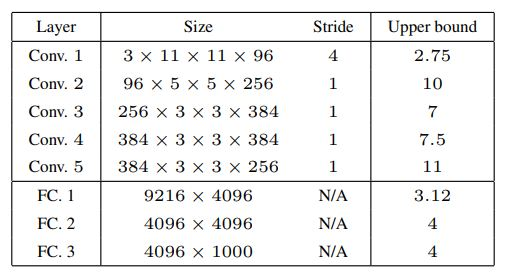
###### Table 5: Frame Bounds of each rectified layer of the network from [9]
table 5는 ImageNet deep convolutional network의 upper Lipschitz bounds를 계산한 것이다. 이를 통해서 처음 convolutional layer에서부터 instability한 것을 볼 수 있다.
 

upper bound를 계산했을 때, 큰 bound가 adversarial example의 존재를 보장하지는 않는다. 하지만 작은 bound는 그러한 example이 나타나지 않도록 보장한다. 이는 upper Lipschitz bound에 불이익을 주도록 구성된 parameter의 정규화를 통해 network의 일반화 오류를 개선시킬 수 있음을 의미한다. 
 

c.f) 
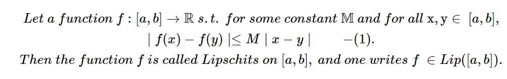
 
립시츠 함수는 두 점 사이의 거리를 일정 비 이상으로 증가시키지 않는 함수를 의미한다. 그리고 립시츠 상수는 (1)을 만족하는 가장 작은 M이다.
 

operator norm은 linear operator의 size를 측정하기 위한 수단이다. 즉, A라는 operator가 x를 변환시키는데 (A : V -> W), 변환시키는 값이 bounded 되어 있고 그것은 ||x||의 c배와 같거나 더 작다는 것을 의미한다. 이를 수식으로 나타내면 다음과 같다. 
 
||A|| = inf{c > 0, ||Av|| <= c||v|| for all v ∈ V}

